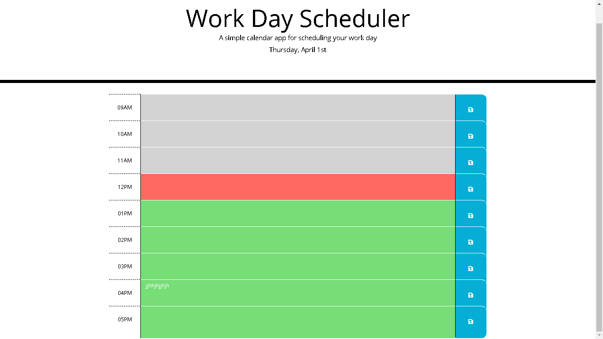

# work-day-scheduler
# Work Day Scheduler Project
## Work Day Scheduler Requirements
* When the planner is open the current day is displayed at the top of the calendar.
* Scrolling the planner, there are presented timeblocks for standard business hours.
* Each timeblock for that day is color coded to indicate whether it is in the past, present, or future.
* Clicking into a timeblock can enter an event.
* Clicking the save button for that timeblock saving the event text in local storage.
* Regardless the page is refreshed the saved events persist.

# Project Image

# Website Link
[Work Day Scheduler](https://jorgeatcabo.github.io/work-day-scheduler/)